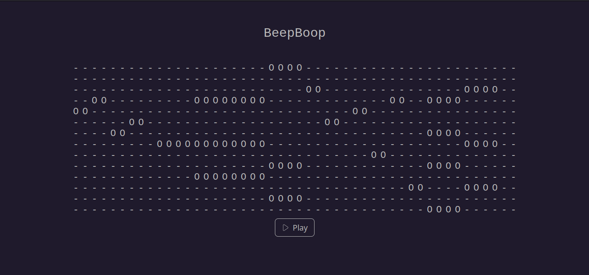

# Unleash Kitchen Sonic Madness

The Unleash Kitchen Sonic Madness project is a musical composing web application BeepBoop coupled with an embedded device communication interface, designed to enable users to create melodies and play them directly on an STM32 Nucleo-64 device.

## Components:

### Client Frontend Application (BeepBoop)

Description: BeepBoop is a musical composing web app built using Next.js framework. It allows users to compose melodies using an intuitive interface.
Directory: beepboop
How to Run: Execute npm run dev to start the application.

### Server Application

Description: The server application, located in the server directory, is developed in Python using the Flask framework. It serves as the backend for the BeepBoop application.
How to Run: Execute python server/app.py to run the server.

### Communication Interface

Description: The communication interface with the embedded device is implemented in C using Arduino.h. It facilitates the transfer of melodies composed in BeepBoop to the STM32 Nucleo-64 device.
Directory: This component is not intended to be run directly but serves as the internal communication mechanism within the full product.

## Usage:

Run the server application using python server/app.py.
Launch the BeepBoop web application with npm run dev.
Compose your melody in BeepBoop and play it directly on the STM32 Nucleo-64 device.

Enjoy creating and playing your own melodies with BeepBoop!

## Contributors ✨

Thanks go to these wonderful people:

-   Martin Beneš
-   Petr Fiedler
-   Martin Vidmar
-   Tomáš Novotný
